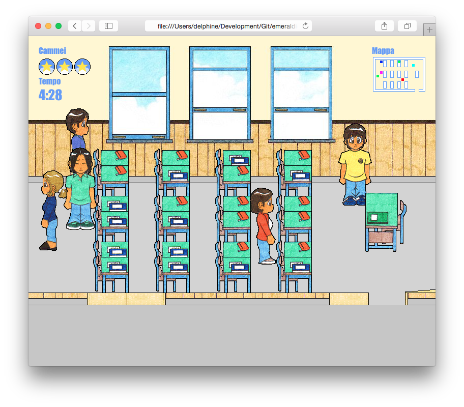

# project-mandarine

A simple 2D game implemented as a single-page JavaScript application.



# Usage

## Clone the repo

```bash
git clone git@github.com:emeraldion/project-mandarine.git
```

## Open in the browser

Open the `mandarine.html` file in the web browser.

# License

Code is released under the [MIT](http://www.opensource.org/licenses/MIT) license.

Images and artwork are copyright (c) Claudio Procida 2002, 2008. All rights reserved.
